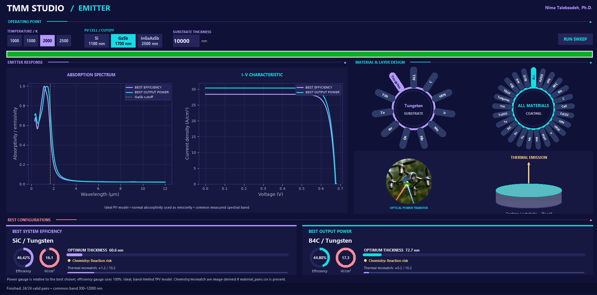

# Spectrally Selective Emitters for Optical Wireless Power Transfer-Thermophotovoltaic 

TMM Studio is a Windows GUI for comparing coating–substrate thermal
emitters coupled to a photovoltaic cell.

Choose an emitter temperature and a Si, GaSb, or InGaAsSb cell.
The tool searches coating thicknesses and displays the structures
that maximize electrical output power and band-limited efficiency.
It plots their absorption spectra and modeled I–V curves.

## Run the application

Open **Releases** and download `TMM_Emitter_Studio.exe`.
Run it on Windows; Python is not required.

## Model scope

The calculations use an idealized PV cell and treat normal-incidence
absorptivity as emissivity. Reported efficiency is band-limited model
efficiency, not measured end-to-end system efficiency.
